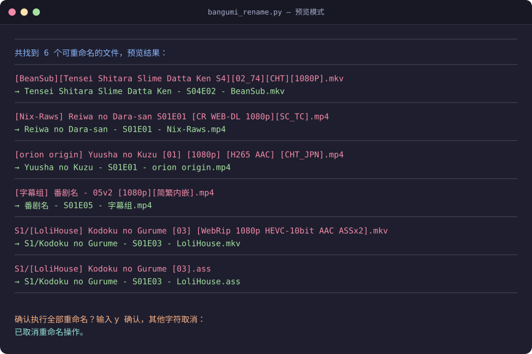

<div align="center">


# 番剧批量重命名工具

**一个适配 Emby 刮削的番剧命名小工具**


</div>

---

一个通用的番剧视频与字幕文件批量重命名脚本，自动适配多种主流番剧命名规则，统一输出 `标题 - SXXEXX - 发布组` 标准格式。支持递归遍历子目录，自带预览确认机制，避免误操作。

## ⬇️ 下载即用（Windows）

不想装 Python？直接拿走打包好的单文件 exe，双击就能跑：

**[`release/v1.1/番剧批量重命名(字幕版).exe`](release/v1.1/)** ｜ 版本改动详见 [更新记录](CHANGELOG.md)

## ✨ 功能特性

- 📦 **多格式兼容** — 覆盖市面绝大多数番剧命名规则，方括号集数、横杠集数、SxxExx 原生格式，以及外站英文点分（scene）发布名均可识别
- 📂 **递归遍历** — 自动扫描当前目录下所有层级子文件夹，视频无需整理到同一目录
- 👁️ **预览确认** — 执行重命名前完整展示所有变更，确认无误后再执行
- 🛡️ **重名保护** — 自动检测目标文件名冲突，跳过重复文件，防止覆盖
- 📝 **字幕同步** — 支持常见字幕格式同步重命名，保持视频与字幕文件名一致
- 🪶 **轻量无依赖** — 仅使用 Python 标准库，无需安装额外第三方包
- 🚀 **可打包分发** — 可打包为独立 EXE 文件，在无 Python 环境的电脑上直接运行

## 🖥️ 运行效果

脚本执行后会列出所有识别到的文件变更，红色为原始文件名，绿色为重命名后的文件名，确认后才会执行：

<div align="center">

</div>

## 🔄 工作流程

<div align="center">

</div>

## 📋 支持的命名格式

| 原文件名 | 重命名后 |
|---------|---------|
| `[orion origin] Yuusha no Kuzu [01] [1080p] [H265 AAC] [CHT_JPN].mp4` | `Yuusha no Kuzu - S01E01 - orion origin.mp4` |
| `[BeanSub][Tensei Shitara Slime Datta Ken S4][02_74][CHT][1080P].mp4` | `Tensei Shitara Slime Datta Ken - S04E02 - BeanSub.mp4` |
| `[smzase] LV999 no Murabito - S01E02 - [CHT_JPN][WebRip 1080P].mkv` | `LV999 no Murabito - S01E02 - smzase.mkv` |
| `[Nix-Raws] Reiwa no Dara-san S01E01 [CR WEB-DL 1080p][SC_TC].mp4` | `Reiwa no Dara-san - S01E01 - Nix-Raws.mp4` |
| `[字幕组] 番剧名 - 05v2 [1080p][简繁内嵌].mp4` | `番剧名 - S01E05 - 字幕组.mp4` |
| `JoJos.Bizarre.Adventure.S06E04.The.Devils.Palm.1080p.NF.WEB-DL.DUAL.AAC2.0.H.264.MSubs-ToonsHub.mkv` | `JoJos Bizarre Adventure - S06E04 - ToonsHub.mkv` |
| `The.Detective.Is.Already.Dead.S02E01.To.See.You.Once.More.1080p.CR.WEB-DL.JPN.AAC2.0.H.264.MSubs-ToonsHub.mkv` | `The Detective Is Already Dead - S02E01 - ToonsHub.mkv` |
| `Show.Name.E07.1080p.WEB-DL.x264.mkv` | `Show Name - S01E07.mkv` |

### 外站英文点分（scene）发布名

ToonsHub、SubsPlease、Erai-raws 等外站资源常把文件名写成
`标题.S01E02.1080p.WEB-DL.DUAL.AAC2.0.H.264.MSubs-发布组.ext` 的形式：
**没有 `[发布组]` 前缀、发布组在结尾、标题用点连接、集号点分夹在中段**，与国内字幕组的命名完全不同。脚本会按下面的规则解析：

| 位置 | 规则 |
|------|------|
| 集号 | 只认点分隔的 `SxxExx` / `Exx` 段（可带 `v2` 版本后缀）；**不认纯数字段**，避免把 `264`、`1080` 当成集号 |
| 标题 | 集号段之前的点分内容，还原为空格连接；集号段之后的副标题与技法信息一律丢弃 |
| 发布组 | 取末段；末段若是分辨率/编码/音轨/语种等冗余标签（如 `1080p`、`x264`、`WEB-DL`、`chs`）则视为没有发布组 |
| 组名前缀 | 末段形如 `MSubs-ToonsHub`、`BluRay-Group`、`264-Group` 时剥掉技法前缀，只保留 `ToonsHub` / `Group`；`Erai-raws`、`Nix-Raws`、`DBD-Raws`、`UHA-WINGS` 等真实带横杠组名原样保留 |

> 含中日文、全角字符、空格，或以 `[ 组 ]` / `( 组 )` 开头的名字不会被这条规则接管，仍走原有解析路径。

**输出格式规范**

- 季数、集数自动补零为两位
- 自动丢弃分辨率、编码、音轨、语言等冗余信息
- 没有发布组信息时省略末段，输出 `标题 - SXXEXX.ext`
- 完整保留原文件扩展名

## 🎞️ 支持的文件格式

| 类型 | 格式 |
|------|------|
| 🎬 视频 | `mp4` `mkv` `avi` `mov` `flv` `wmv` `rmvb` `m4v` |
| 💬 字幕 | `srt` `ass` `ssa` `vtt` `mks` |

> 可在脚本顶部 `VIDEO_EXTENSIONS` 配置项中自行扩展。

## 🚀 使用方法

### 环境要求

- Python 3.7 及以上版本

### 快速开始

1. 将 `bangumi_rename.py` 放入番剧根目录
2. 打开终端 / 命令行，执行命令：

```bash
python bangumi_rename.py
```

### 指定目录运行

修改脚本末尾的调用参数，传入目标文件夹绝对路径即可：

```python
if __name__ == "__main__":
    batch_rename_videos(r"E:\Bangumi暂存")
```

### 配置说明

| 配置项 | 说明 | 默认值 |
|--------|------|--------|
| `DEFAULT_SEASON` | 文件名未标注季数时，默认使用的季数 | `1` |
| `VIDEO_EXTENSIONS` | 需要处理的文件扩展名集合 | 见脚本内预设 |
| `SCENE_TECH_TOKENS` | 英文点分名末段中视为冗余标签的标记（永远不当发布组） | 见脚本内预设 |
| `SCENE_GROUP_PREFIXES` | 末段形如 `技法前缀-组名` 时可剥离的前缀 | 见脚本内预设 |

### 解析引擎测试

```bash
python tests/test_extract_info.py
```

覆盖方括号集数、横杠集数、空格 + SxxExx、横杠 + 版本号、外站英文点分名，
以及「点分但无集号」等不应被误吞的反例。

## 📦 打包为独立 EXE

可通过 PyInstaller 打包为单文件可执行程序，在无 Python 环境的电脑上直接运行：

```bash
# 1. 安装 PyInstaller
pip install pyinstaller

# 2. 执行打包命令
pyinstaller --onefile --name "番剧批量重命名(字幕版)" bangumi_rename.py

# 3. 打包完成后，可执行文件位于 dist 目录内
```

## ⚠️ 注意事项

1. 重要文件建议先备份，确认预览结果无误后再执行重命名
2. 脚本仅修改文件名，不会改动文件内容与存储位置
3. `.pptd`、`.cfg`、`.part` 等下载临时文件会自动跳过
4. 若目标文件名已存在，将自动跳过该文件，避免覆盖
5. 文件名含特殊系统保留字符时，以操作系统支持规则为准

## 📝 更新记录

完整说明（改了什么、为什么改）见 [CHANGELOG.md](CHANGELOG.md)。

| 版本 | 更新内容 |
|------|---------|
| v1.1 | **支持外站英文点分（scene）发布名** —— `标题.S01E02.1080p.WEB-DL.DUAL.AAC2.0.H.264.MSubs-发布组.ext` 由「无法识别」变为可直接重命名：只认点分隔的 `SxxExx` / `Exx` 段（不认纯数字，避免把 264 / 1080 当集号）、末段技法前缀自动剥离、无发布组时省略末段；含中日文/全角/空格的名字仍走原有路径。同时抽出 `build_filename` 统一输出拼接，新增解析引擎测试 `tests/test_extract_info.py`；并修掉「工作区混有无法识别文件时打印 `⚠️` 致 GBK 崩溃、确认后一个文件都没改」的问题 |
| v1.0 | 首个版本 —— 方括号集数 / 横杠集数 / SxxExx 三类命名，递归遍历、预览确认、重名保护、字幕同步、可打包 EXE |

## 🙏 鸣谢

- [Emby](https://emby.media/) — 提供优秀的媒体库管理与刮削体系，本工具的输出格式即为适配其刮削规范
- [PyInstaller](https://pyinstaller.org/) — 让脚本可以打包为免安装的可执行程序
- 各汉化字幕组 / 压制组 —— 番剧中文字幕与压制资源的源头，本工具处理的正是他们的劳动成果
- 所有为本项目提出建议与反馈的朋友

## 📄 开源协议

本项目基于 [MIT License](LICENSE) 开源，欢迎自由使用、修改与分发。

<div align="center">

**如果这个工具对你有帮助，欢迎点一个 ⭐ Star 支持一下！**

</div>
